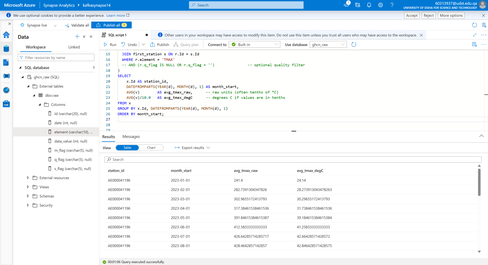
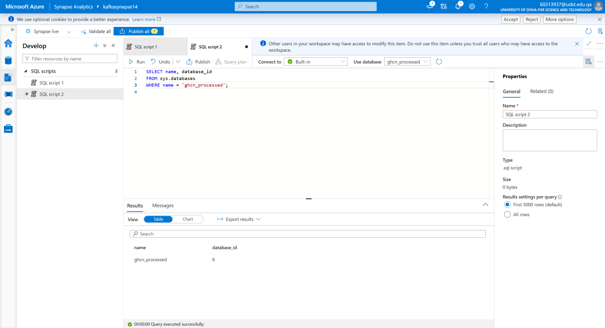
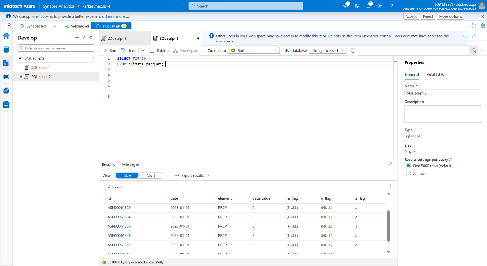
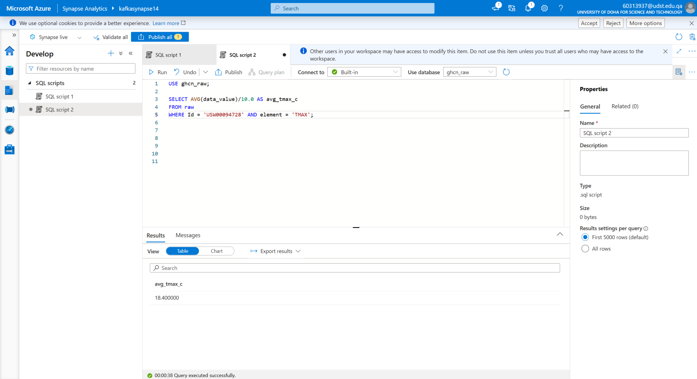
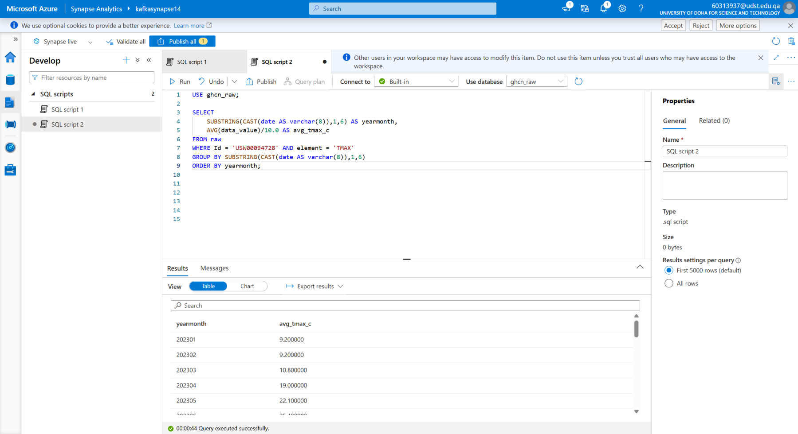
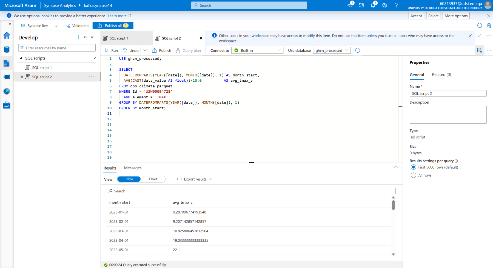
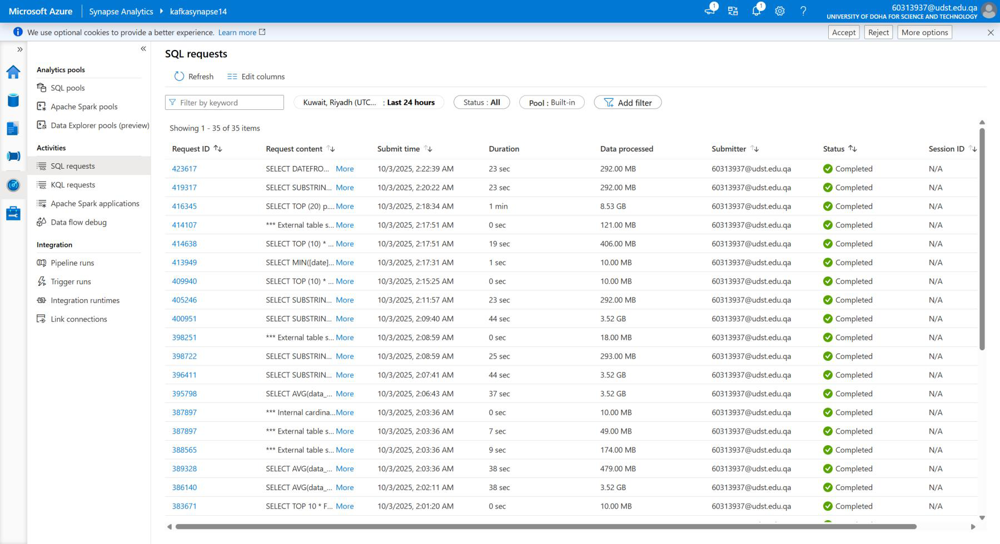
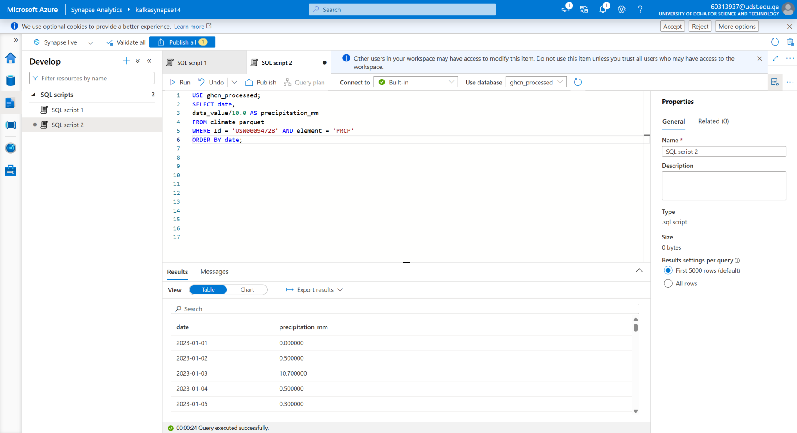

# Lab 2 – Data Ingestion in Azure  
Data Engineering on Azure

This repository contains the full implementation and solution for Lab 2 – Data Ingestion in Azure.  
The goal is to build an end-to-end data ingestion and analytics pipeline using Azure services and NOAA climate datasets.

---

1. Overview

In this lab, we work with real NOAA weather data (daily precipitation and temperature).  
The main objectives are:

- Upload raw CSV files into Azure Blob Storage  
- Register external tables in Azure Synapse Serverless SQL  
- Convert CSV files into optimized Parquet format using CETAS  
- Create filtered analytical datasets (precipitation + TMAX for one station)  
- Connect Azure Machine Learning Notebook to Synapse and visualize data  
- Compare query performance between CSV and Parquet  

This lab demonstrates the basic structure of a cloud-based data lake and analytics pipeline.

---

2. Dataset

The dataset is the NOAA GHCN-Daily (Global Historical Climatology Network).  
We use climate data for the years:

- 2023  
- 2024  
- 2025  

Each file includes:

- `Id` – Weather station ID (e.g., USW00094728)  
- `date` – Date in YYYYMMDD format  
- `element` – Measurement type (PRCP, TMAX, etc.)  
- `data_value` – Measurement value  
- Quality flags  

A major part of the lab focuses on station USW00094728 – New York Central Park.

---

3. Architecture

```

Local Machine
↓
Azure Blob Storage (Data Lake Gen2)
├── raw/
├── processed/
└── curated/
↓
Azure Synapse Serverless SQL
├── External table on CSV
└── External table on Parquet (CETAS)
↓
Azure Machine Learning
└── Notebook for data visualization

```

---

4. Folder Structure

```

LAB2/
│
├── images/                # All screenshots used in README
├── data/                  # (Optional) Local storage
├── notebooks/
│   └── ClimateDataAnalysis.ipynb
└── README.md

````

The `images/` folder contains all screenshots extracted from the PDF.

---

5. Step-by-Step Pipeline

5.1 Upload Raw Data to Azure Storage
- Create a Storage Account with hierarchical namespace.
- Create containers:
  - `raw`
  - `processed`
  - `curated`
- Upload the 2023–2025 CSV files into the `raw` container.

---

5.2 Create External Tables in Synapse

```sql
CREATE DATABASE ghcn_raw;
USE ghcn_raw;

CREATE EXTERNAL FILE FORMAT CsvFormat
WITH (
    FORMAT_TYPE = DELIMITEDTEXT,
    FORMAT_OPTIONS(FIRST_ROW = 2, FIELD_TERMINATOR = ',')
);

CREATE EXTERNAL TABLE raw (
    Id VARCHAR(20),
    date INT,
    element VARCHAR(10),
    data_value INT,
    m_flag VARCHAR(5),
    q_flag VARCHAR(5),
    s_flag VARCHAR(5)
)
WITH (
    LOCATION = 'raw/',
    DATA_SOURCE = MyBlobStorage,
    FILE_FORMAT = CsvFormat
);
````

---

5.3 Exploration Queries

Examples:

```sql
SELECT COUNT(*) FROM raw;
SELECT TOP 10 * FROM raw ORDER BY Id, date;
SELECT COUNT(DISTINCT Id) FROM raw;
```

---

5.4 Convert CSV to Parquet (CETAS)

```sql
CREATE DATABASE ghcn_processed;
USE ghcn_processed;

CREATE EXTERNAL TABLE climate_parquet
WITH (
  LOCATION = 'processed/parquet_data/',
  DATA_SOURCE = MyBlobStorageWrite,
  FILE_FORMAT = ParquetFormat
)
AS
SELECT * FROM ghcn_raw.dbo.raw;
```

Parquet improves performance and reduces storage size.

---

5.5 Create Analytical Subsets

Precipitation Series

```sql
CREATE EXTERNAL TABLE prcp_series
WITH (
  LOCATION = 'processed/prcp_series/',
  DATA_SOURCE = MyBlobStorageWrite,
  FILE_FORMAT = ParquetFormat
)
AS
SELECT CAST(date AS VARCHAR(8)) AS date,
       data_value / 10.0 AS precipitation_mm
FROM climate_parquet
WHERE Id = 'USW00094728'
  AND element = 'PRCP'
ORDER BY date;
```

TMAX Series

```sql
CREATE EXTERNAL TABLE tmax_series
WITH (
  LOCATION = 'processed/tmax_series/',
  DATA_SOURCE = MyBlobStorageWrite,
  FILE_FORMAT = ParquetFormat
)
AS
SELECT CAST(date AS VARCHAR(8)) AS date,
       data_value / 10.0 AS max_temp_c
FROM climate_parquet
WHERE Id = 'USW00094728'
  AND element = 'TMAX'
ORDER BY date;
```

---

5.6 Azure ML Notebook

In the notebook:

* Connect to Synapse SQL using SQLAlchemy
* Load `prcp_series` and `tmax_series` tables into pandas
* Convert dates to datetime
* Plot the data using matplotlib

---

6. Example Visualizations

Below are screenshots generated during the lab.
All images are stored in the `images/` folder.

Raw Data Preview



Distinct Stations / Measurement Types




Date Range



Aggregations





Parquet & Performance




Precipitation Series



---

7. Homework Summary

* Data profiling
* SQL queries
* CSV → Parquet conversion
* Performance comparison
* Year-to-year precipitation analysis
* Visualizations in Azure ML Notebook

---

8. How to Run

1. Clone this repository
2. Upload CSV files to Azure Storage
3. Execute SQL scripts in Synapse
4. Run the notebook in Azure ML
5. Update connection strings
6. Visualize results

---

9. Author

Mohamed ElTayeb
Master’s Student – Artificial Intelligence & Cognitive Cybersecurity
Cybersecurity Engineer
GitHub: [https://github.com/momo23121](https://github.com/momo23121)


